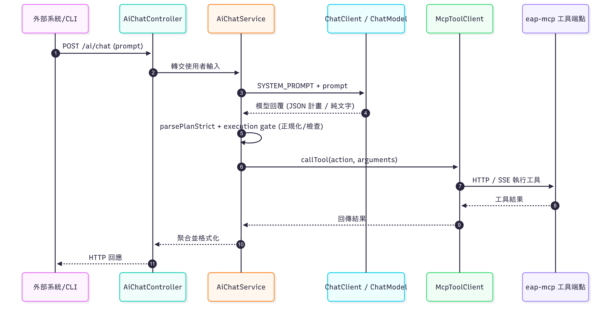

Day 29｜總整篇：從能對話到能執行：ai-client 的穩定骨架

這一篇把前面三篇（01 Build、02 Config、03 Implementation）收成一口氣能看懂、能跑起來、也知道怎麼擴充的「cheat sheet」。對我自己來說，它是把 LLM + MCP 串成可控、可測、可擴充流程的關鍵里程碑。

### 系統心智圖

eap-ai-client 的定位：LLM 編排器 + MCP 工具呼叫器。
LLM 負責「理解與規劃」，MCP 工具負責「確定地執行」。兩者之間由 AiChatService 黏起來；當模型能輸出**結構化 JSON 計畫（Plan）**時，我就用它精確地呼叫工具；若模型改丟純文字，則以降級策略處理。
flowchart

<p align="center">
  
</p>


### A. Build 快速上手

模組結構重點

`config`：ChatClientAutoConfig、McpClientConfig、OllamaConfig、EapMcpProperties

`controller`：AiChatController

`service`：AiChatService、McpToolClient、McpConnectionService

`resources`application.yml

主要相依與用途

`Spring Boot：web / validation / actuator`

`Spring AI：ChatClient（包覆 provider 的 ChatModel）`

`HTTP 客戶端：WebClient（或 Feign）`

`Jackson、Lombok、JUnit/Mockito`


### B. Configuration 要點（把線都插對）

application.yml（簡化示例）
```
spring:
  application:
    name: eap-ai-client

ai:
  provider:
    name: "ollama"          
    endpoint: "http://localhost:11434"

mcp:
  server:
    base-url: "http://localhost:8083"   # eap-mcp 對外位址

logging:
  level:
    com.eap.ai: DEBUG
```

**MCP 連線設定**

以` EapMcpProperties` 包裝組態：baseUrl / basePath / ssePath / messagePath / timeoutSeconds

`McpClientConfig` 基於上述屬性建立傳輸（HTTP / SSE），並產生 McpSyncClient 或我的 HTTP wrapper

優點：啟動即驗證設定（`@Validated、@NotBlank、@Min`），錯誤提早暴露、排查更輕鬆

**LLM provider 設定**

`OllamaConfig` 產出 OllamaApi（低階 client）

`Spring AI `的 `Ollama provider `自動生出 ChatModel

`ChatClientAutoConfig `檢出 `ChatModel` → 建立 `ChatClient`

需要多 provider？用 `profile` 或` @ConditionalOnProperty `切換


### C. Implementation 精華（把它變「可控」）

`AiChatService` 的四步流程

`Prompt`：嚴格的 SYSTEM_PROMPT，優先要求輸出 JSON 計畫（actions[] + arguments），同時允許純文字結果的降級路徑

`Parse`：parsePlanStrict 容錯抽取 JSON（直出 / ```json fenced / 混雜內容）

`Gate`：validateRequiredParams + normalizeArgs

去除千分位、大小寫正規化（BUY/SELL、ELC）

`runSimulation` 會先做 checkUserExists；若不存在則嘗試 registerUser

`Execute`：逐個 action 呼叫 McpToolClient，單點失敗不拖累整體（以錯誤物件回填）

**McpToolClient 的角色**

封裝對 MCP 工具的呼叫（HTTP / SSE）

輸出標準化（成功/錯誤結構一致），讓 `AiChatService `專注編排

為什麼要這樣做

LLM 容易「看起來很懂、實際亂下單」；我把執行權留在` AiChatService`：以 JSON 計畫 + Gate 決定能否執行

只要工具介面穩，Prompt 可演進，後端不必大改

### D. 這個架構的價值（為什麼它能長大）

- 可替換的 LLM provider：`ChatClientAutoConfig` 只依賴 `ChatModel`；provider 能自由切換

- 可演進的工具層：MCP 工具是清楚的 API，對外穩定，對內可重構

- 可測：Plan parsing 與工具呼叫分離，允許單測/整測清楚覆蓋

### 結語

到這裡，我已經把一個「能聽懂人話」的 AI，綁上一條「只做正確事」的安全繩。
eap-ai-client 不是魔法，而是一套可驗證的工程套路：嚴謹的 Prompt → 可解析的 Plan → 可控的 Gate。
